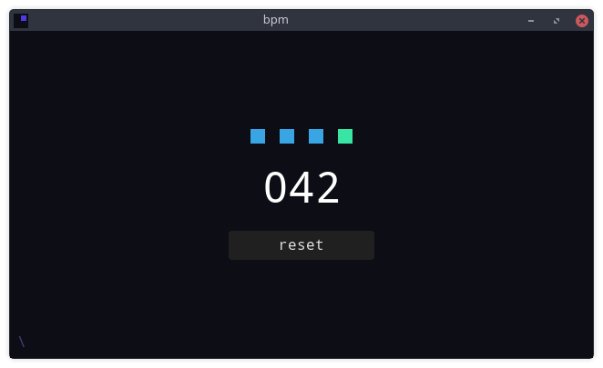

# bpm
Simplistic beats per minute counter

It calculates bpm based on the tempo of your keypresses, mouse clicks, taps,
joystick button presses, or MIDI inputs (that last one is very much untested).

## Installation

Download the appropriate build for your platform, unpack, and run.
On GitHub, builds are available under "Releases".

## Contributing

Issues and PRs are welcome, for all kinds of contributions.
Changes accepted in PRs will be released under the license terms
listed below.

## License

Copyright 2020 Iwo 'Outfrost' Bujkiewicz

This is free/libre software, released under the MIT License.
See LICENSE.md for license terms.

Noto fonts (`fonts/Noto/`) Copyright 2018 The Noto Project Authors.
Noto is licensed under the SIL Open Font License, Version 1.1,
available with a FAQ at: http://scripts.sil.org/OFL.
See also: https://github.com/googlefonts/noto-fonts.

Created with Godot Engine.
See https://godotengine.org/license for credits and license terms.
